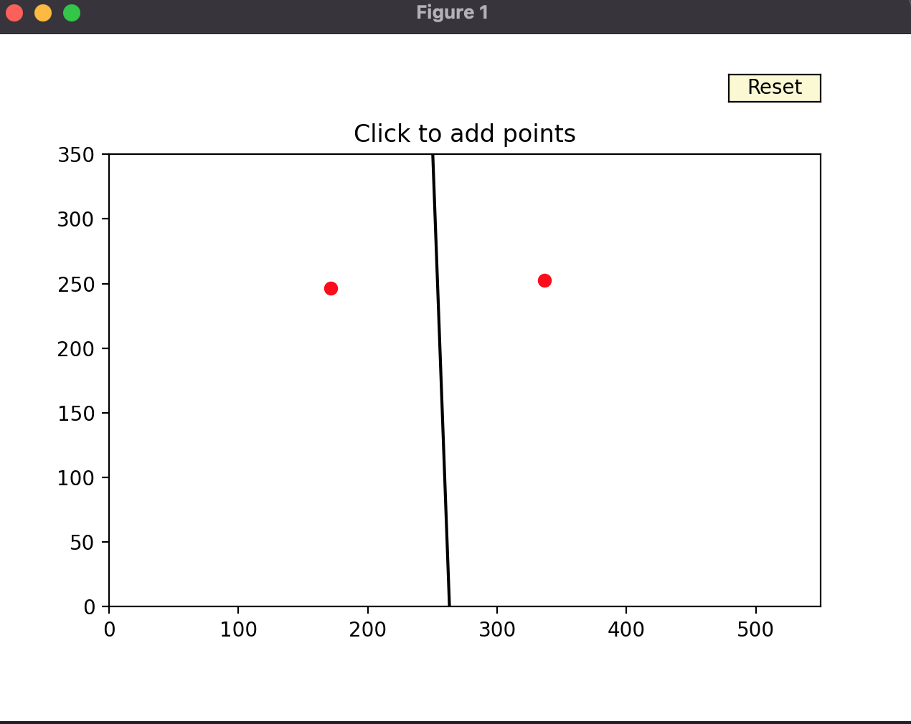
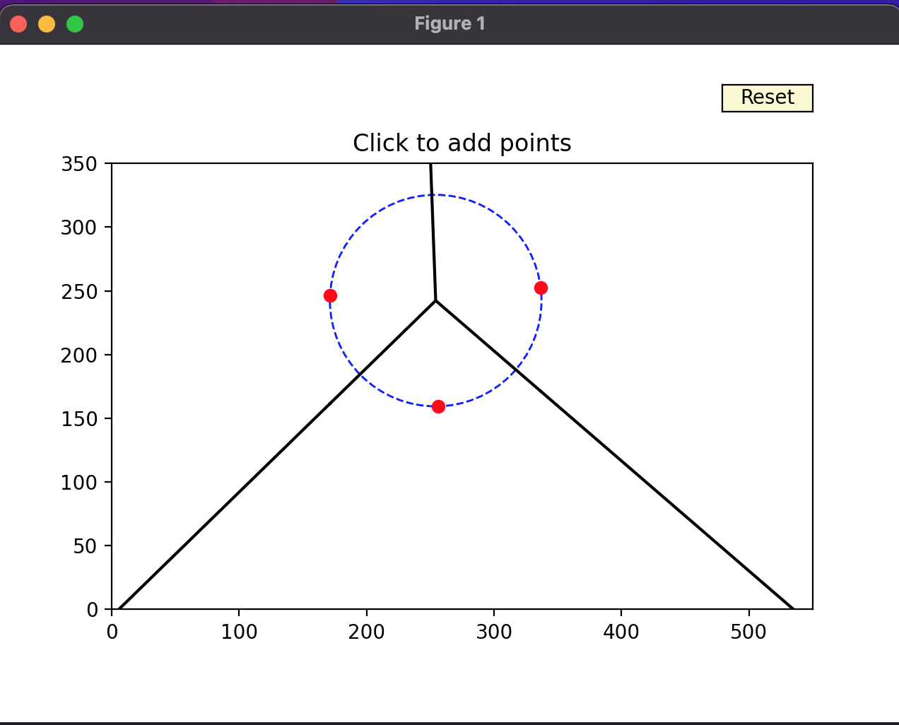
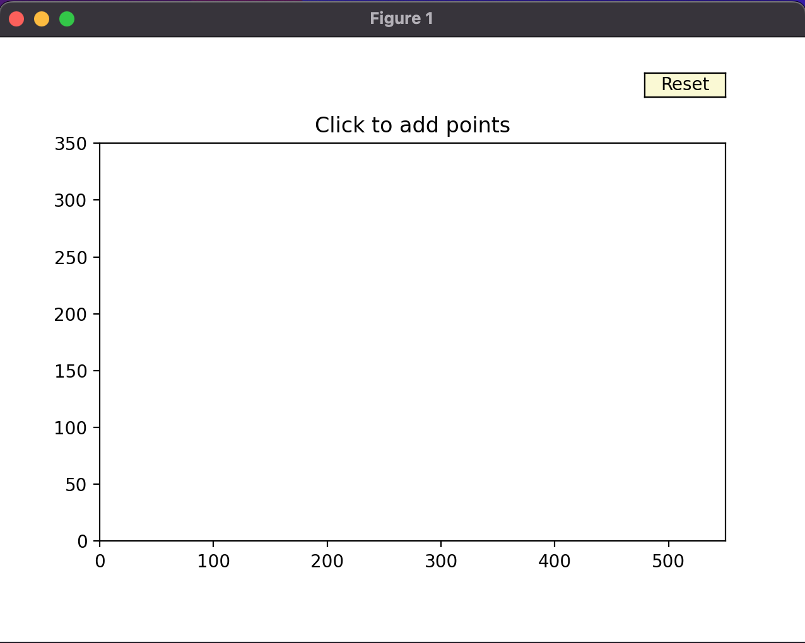

# Tugas Pemrograman Geometri Komputasional Gasal 2024/2025

### Kelompok 10
**(1) Arya Lesmana - 2206081603**   
**(2) Muhammad Nanda Pratama - 2206081654**  
**(3) Naufal Ichsan - 2206082013**

**Deskripsi:**   
Implementasi Python terhadap algoritma Fortune untuk membuat diagram Voronoi dengan titik-titik yang dibatasi bounding box, sekaligus menampilkan *Largest Empty Circle* yang melewati tiga point.

Cara penggunaan
---
Notes: Sebelum menjalankan code, implementasi kami membutuhkan dependensi dari library external `matplotlib` yang dimiliki python. **(Disarankan menggunakan virtual environment)**
<br>


Tanpa input txt files, dapat melakukan run di terminal/command prompt
```bash
python voronoi.py
```


Apabila terdapat input txt files, dapat melakukan run di terminal/command prompt
```bash
python voronoi.py file.txt
```

Contoh Penggunaan
---
Anda dapat menambahkan point dalam bounding box dengan mengkliknya   




Anda dapat mereset voronoi diagram dengan mengklik tombol reset  




